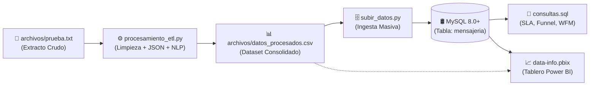

# 📊 Pipeline ETL & Dashboard Analítico: Campaña WhatsApp BPO

Solución integral de **Ingeniería de Datos y Business Intelligence** diseñada para extraer, procesar, almacenar y analizar el rendimiento técnico y la operación de una campaña masiva de mensajería a través de la **API de WhatsApp (Meta)**.

---

## 🏗️ Arquitectura del Pipeline de Datos

El flujo completo del proyecto abarca desde la ingesta del dato crudo hasta la explotación visual en Power BI:



---

## 📂 Estructura del Repositorio

```text
├── archivos/
│   ├── prueba.txt               # Extracto transaccional crudo (delimitado por '|', JSON anidados)
│   └── datos_procesados.csv     # Resultado final del ETL (limpio, tipificado y en UTF-8-SIG)
├── procesamiento_etl.py         # Pipeline de extracción, limpieza y enriquecimiento en Python
├── subir_datos.py               # Script de creación de tabla e ingesta masiva en MySQL
├── consultas.sql                # Consultas analíticas (Funnel, SLA con funciones ventana y WFM)
├── data-info.pbix               # Reporte analítico interactivo en Power BI Desktop
└── README.md                    # Documentación técnica y ejecutiva del proyecto
```

---

## ⚙️ Detalle de los Procesos y Scripts

### 1. Extracción y Transformación (`procesamiento_etl.py`)
El script toma el extracto transaccional [`archivos/prueba.txt`](./archivos/prueba.txt) y resuelve los siguientes retos de calidad de datos:

1. **Lectura y Decodificación Segura:**
   - Abre el archivo en modo binario y controla la decodificación en `UTF-8` con reemplazo de caracteres anómalos para preservar tildes, caracteres especiales (`ñ`) y emojis.
   - Elimina líneas decorativas y separadores de tabla (`|---|---|`).
   - Descarta columnas fantasma generadas por delimitadores al inicio y final de cada línea.
   - Normaliza cadenas nulas (`nan`, `None`, `<NA>`, vacíos) a valores nulos reales.

2. **Parsing y Respaldo de Atributos JSON:**
   - **`error_exacto`:** Extrae la causa raíz técnica contenida dentro de estructuras JSON en las columnas `content` o `content_attributes` para mensajes con `status = 'failed'`.
   - **`nombre_plantilla`:** Extrae el nombre de la plantilla de Meta desde `additional_attributes.template_params`.
   - **Tolerancia a fallos:** Si un JSON viene malformado o con comillas escapadas, utiliza un mecanismo de respaldo mediante expresiones regulares (RegEx) para rescatar la información sin truncar la ejecución.

3. **Clasificación de Mensajes Entrantes (`incoming`) por Reglas:**
   - Categoriza los mensajes de respuesta de los clientes mediante un clasificador basado en expresiones regulares con orden de precedencia estricto:
     - **Queja/Reclamo:** Prioridad alta ante términos como *cobraron, inconforme, no llegó, reclamo, fallo, error*.
     - **Pedido/Ventas:** Identifica intenciones de compra como *pedido, catálogo, comprar, precio, ofertas*.
     - **Soporte/Información:** Captura solicitudes de asistencia como *ayuda, llamada, asesor, líder, información*.
     - **Consulta General:** Asignación por defecto para el resto de consultas no específicas.

4. **Exportación Consolidada:**
   - Imprime un diagnóstico de control de calidad por consola (filas leídas, porcentaje de errores extraídos y categorizados).
   - Genera [`archivos/datos_procesados.csv`](./archivos/datos_procesados.csv) con codificación `utf-8-sig` y entrecomillado total (`QUOTE_ALL`) para compatibilidad directa con Excel y motores de base de datos.

---

### 2. Carga e Ingesta a Base de Datos (`subir_datos.py`)
Automatiza el cargue del archivo procesado hacia MySQL:
- **Creación de Entorno:** Valida y crea la base de datos `dev` y la tabla `mensajeria` si no existen, configuradas con codificación `utf8mb4_unicode_ci`.
- **Mapeo Estricto de 27 Columnas:** Sanea los nombres de campo y descarta columnas no pertenecientes al esquema oficial.
- **Inserción Masiva Optimizada:** Ejecuta un `TRUNCATE TABLE` para evitar duplicados y carga los registros mediante inserción por lotes (`cursor.executemany`) para máxima eficiencia.

---

### 3. Consultas Analíticas Avanzadas (`consultas.sql`)
Scripts SQL optimizados para MySQL 8.0+:
- **Funnel de Entrega:** Agregación de volumen y porcentaje de contribución por estado (*read, delivered, failed*).
- **SLA Operativo de Primera Respuesta:** Emplea funciones analíticas de ventana (`LEAD()`, `TIMESTAMPDIFF()`) para calcular el tiempo exacto en minutos entre la recepción de un mensaje de un cliente (`incoming`) y la siguiente acción del asesor (`outgoing` o `activity`) dentro de la misma conversación.
- **Curva de Demanda WFM:** Agrupación por hora del día para identificar horarios de sobrecarga operativa y dimensionar turnos.

---

### 4. Tablero Interactivo (`data-info.pbix`)
Reporte desarrollado en Power BI que consolida la capa visual para la toma de decisiones:
- **KPIs Principales:** Tasa de fallas masivas, tiempo promedio de respuesta (SLA), tráfico total entrante y efectividad de lectura.
- **Funnel de Distribución:** Visualización del ratio de entrega frente a fallos.
- **Diagnóstico de Errores Meta API:** Distribución por código de error técnico.
- **Curva Horaria de Demanda:** Monitoreo de picos de tráfico para planificación de turnos de agentes (WFM).
- **Categorización de Clientes:** Clasificación temática de mensajes entrantes.

---

## 📊 Indicadores Clave del Estudio

| Métrica | Resultado | Interpretación |
| :--- | :---: | :--- |
| **Tasa de Fallas Masivas** | **55.68%** | 1,396 envíos fallidos; el 98.4% correspondió al código `#132000` (incompatibilidad de parámetros por variables vacías en plantillas). |
| **Efectividad de Lectura** | **28.24%** | Mensajes leídos confirmados por los usuarios destinatarios. |
| **SLA Promedio de Respuesta** | **14.8 min** | Tiempo promedio de atención operativa ante consultas de clientes. |
| **Tráfico Entrante (Incoming)** | **430 msgs** | Volumen de respuestas generadas por los usuarios tras el disparo masivo. |

---

## 🚀 Guía de Ejecución Local

### Prerrequisitos
- Python 3.8+
- MySQL Server 8.0+
- Power BI Desktop

Instala las dependencias necesarias de Python:
```bash
pip install pandas mysql-connector-python
```

### Paso a paso:

1. **Ejecutar el Pipeline ETL:**
   ```bash
   python procesamiento_etl.py
   ```
   *Salida esperada:* Se generará el archivo `archivos/datos_procesados.csv` y se mostrará el reporte de calidad en la terminal.

2. **Cargar los datos a MySQL:**
   *(Asegúrate de configurar tu usuario y contraseña en `DB_CONFIG` dentro de `subir_datos.py`)*
   ```bash
   python subir_datos.py
   ```

3. **Ejecutar Consultas o Abrir el Dashboard:**
   - Ejecuta las consultas de `consultas.sql` en tu gestor de MySQL (DBeaver, MySQL Workbench, etc.).
   - Abre [`data-info.pbix`](./data-info.pbix) en **Power BI Desktop** para explorar el tablero interactivo.
